# System Architecture Overview
## AI-Powered Threat Detection through Encrypted Network Traffic Analysis

---

## 📋 High-Level System Architecture

```mermaid
graph TB
    %% ===== Main Input Node =====
    INPUT["<b>🌐 ENCRYPTED NETWORK TRAFFIC</b><br/><br/>HTTPS • TLS 1.3 • QUIC<br/>Real-time Data Stream"]
    
    %% ===== LAYER 1: Data Collection =====
    subgraph LAYER1["<b>📥 LAYER 1: DATA COLLECTION & CAPTURE</b>"]
        direction TB
        L1A["<b>Network Interface</b><br/><br/>Promiscuous Mode<br/>Live Traffic Monitoring"]
        L1B["<b>Packet Capture Tools</b><br/><br/>Wireshark • tcpdump<br/>Raw Packet Data"]
        L1C["<b>Dataset Loader</b><br/><br/>CIC-IDS2018<br/>Labeled Traffic Samples"]
    end
    
    %% ===== LAYER 2: Preprocessing =====
    subgraph LAYER2["<b>🔧 LAYER 2: DATA PREPROCESSING</b>"]
        direction TB
        L2A["<b>Data Cleaning</b><br/><br/>Remove Nulls<br/>Handle Duplicates<br/>Outlier Detection"]
        L2B["<b>Flow Aggregation</b><br/><br/>5-Tuple Grouping<br/>Src/Dst IP & Port<br/>Protocol Type"]
        L2C["<b>Normalization</b><br/><br/>StandardScaler<br/>Feature Scaling<br/>Range: 0-1"]
        L2D["<b>Class Balancing</b><br/><br/>SMOTE Algorithm<br/>Oversample Minority<br/>Balanced Dataset"]
    end
    
    %% ===== LAYER 3: Feature Extraction =====
    subgraph LAYER3["<b>📊 LAYER 3: FEATURE ENGINEERING</b>"]
        direction TB
        L3A["<b>Packet Features</b><br/><br/>Packet Size<br/>Header Length<br/>Flags & Options<br/><i>≈20 features</i>"]
        L3B["<b>Flow Features</b><br/><br/>Duration • Bytes/Packets<br/>IAT Statistics<br/>Flow Rate Metrics<br/><i>≈60 features</i>"]
        L3C["<b>Temporal Features</b><br/><br/>Time Windows<br/>Burst Patterns<br/>Session Duration<br/><i>≈10 features</i>"]
        L3D["<b>⭐ FINAL FEATURE VECTOR ⭐</b><br/><br/>Combined Features<br/><b>80 Dimensions</b><br/>Ready for ML Models"]
    end
    
    %% ===== LAYER 4: Machine Learning =====
    subgraph LAYER4["<b>🤖 LAYER 4: MACHINE LEARNING MODELS</b>"]
        direction LR
        L4A["<b>Random Forest</b><br/><br/>Ensemble Learning<br/>Decision Trees<br/>High Accuracy"]
        L4B["<b>XGBoost</b><br/><br/>Gradient Boosting<br/>Fast Training<br/>Best Performance"]
        L4C["<b>CNN</b><br/><br/>Deep Learning<br/>Spatial Features<br/>Pattern Recognition"]
        L4D["<b>LSTM</b><br/><br/>Recurrent Network<br/>Sequential Data<br/>Temporal Patterns"]
        L4E["<b>Hybrid Model</b><br/><br/>CNN + LSTM<br/>Combined Approach<br/>Enhanced Detection"]
        L4F["<b>⭐ MODEL SELECTION ⭐</b><br/><br/>Performance Metrics<br/><b>Accuracy: 100%</b><br/>Precision • Recall • F1"]
    end
    
    %% ===== LAYER 5: Threat Detection =====
    subgraph LAYER5["<b>🎯 LAYER 5: THREAT DETECTION & ANALYSIS</b>"]
        direction TB
        L5A["<b>Binary Classification</b><br/><br/>Benign Traffic<br/>vs<br/>Malicious Activity"]
        L5B["<b>Attack Type Identification</b><br/><br/>Botnet Detection<br/>DDoS • Infiltration<br/>Brute Force • Web Attack"]
        L5C["<b>Confidence Scoring</b><br/><br/>Probability Score<br/>Range: 0-100%<br/>Threshold: 85%"]
        L5D["<b>Severity Assessment</b><br/><br/>Risk Level Rating<br/>Low • Medium<br/>High • Critical"]
    end
    
    %% ===== LAYER 6: Alert & Response =====
    subgraph LAYER6["<b>🚨 LAYER 6: ALERT & RESPONSE SYSTEM</b>"]
        direction TB
        L6A["<b>⚡ Real-time Alerts</b><br/><br/>Instant Detection<br/>Automated Response<br/>< 1 second latency"]
        L6B["<b>📝 Logging System</b><br/><br/>Event Recording<br/>Audit Trail<br/>Historical Analysis"]
        L6C["<b>📊 Visualization Dashboard</b><br/><br/>Live Monitoring<br/>Statistics & Graphs<br/>Traffic Analytics"]
        L6D["<b>📧 Notification System</b><br/><br/>Multi-channel Alerts<br/>Email • SMS • Slack<br/>Security Team Notify"]
    end
    
    %% ===== Connections =====
    INPUT ==> L1A
    INPUT ==> L1B
    INPUT ==> L1C
    
    L1A ==> L2A
    L1B ==> L2A
    L1C ==> L2A
    
    L2A ==> L2B
    L2B ==> L2C
    L2C ==> L2D
    
    L2D ==> L3A
    L2D ==> L3B
    L2D ==> L3C
    
    L3A ==> L3D
    L3B ==> L3D
    L3C ==> L3D
    
    L3D ==> L4A
    L3D ==> L4B
    L3D ==> L4C
    L3D ==> L4D
    L3D ==> L4E
    
    L4A ==> L4F
    L4B ==> L4F
    L4C ==> L4F
    L4D ==> L4F
    L4E ==> L4F
    
    L4F ==> L5A
    L5A ==> L5B
    L5B ==> L5C
    L5C ==> L5D
    
    L5D ==> L6A
    L5D ==> L6B
    L5D ==> L6C
    L5D ==> L6D
    
    %% ===== Professional Color Scheme with High Contrast =====
    classDef inputStyle fill:#1565c0,stroke:#0d47a1,stroke-width:5px,color:#ffffff,font-size:16px,font-weight:bold
    
    classDef layer1Style fill:#fff3e0,stroke:#e65100,stroke-width:4px,color:#1a1a1a,font-size:14px,font-weight:bold
    
    classDef layer2Style fill:#f3e5f5,stroke:#6a1b9a,stroke-width:4px,color:#1a1a1a,font-size:14px,font-weight:bold
    
    classDef layer3Style fill:#e8f5e9,stroke:#2e7d32,stroke-width:4px,color:#1a1a1a,font-size:14px,font-weight:bold
    
    classDef layer4Style fill:#fff9c4,stroke:#f57f17,stroke-width:4px,color:#1a1a1a,font-size:14px,font-weight:bold
    
    classDef layer5Style fill:#ffe0b2,stroke:#d84315,stroke-width:4px,color:#1a1a1a,font-size:14px,font-weight:bold
    
    classDef layer6Style fill:#ffcdd2,stroke:#b71c1c,stroke-width:4px,color:#1a1a1a,font-size:14px,font-weight:bold
    
    classDef highlightStyle fill:#ffd600,stroke:#f57f17,stroke-width:6px,color:#000000,font-size:15px,font-weight:bold
    
    %% ===== Apply Styles =====
    class INPUT inputStyle
    class L1A,L1B,L1C layer1Style
    class L2A,L2B,L2C,L2D layer2Style
    class L3A,L3B,L3C layer3Style
    class L3D,L4F highlightStyle
    class L4A,L4B,L4C,L4D,L4E layer4Style
    class L5A,L5B,L5C,L5D layer5Style
    class L6A,L6B,L6C,L6D layer6Style
```

---

## 🏗️ Detailed Layer Descriptions

### 📥 **Layer 1: Data Collection**

**Purpose:** Capture and load network traffic data from multiple sources

| Component | Description | Tools |
|-----------|-------------|-------|
| Network Interface | Captures live network packets | NIC in promiscuous mode |
| Packet Capture | Records network traffic | Wireshark, tcpdump, Scapy |
| Dataset Loader | Loads historical datasets | CIC-IDS2018 CSV reader |

**Output:** Raw network packets and flow records

---

### 🔧 **Layer 2: Preprocessing**

**Purpose:** Clean and prepare data for feature extraction

| Step | Operation | Purpose |
|------|-----------|---------|
| 1. Data Cleaning | Remove nulls, duplicates, outliers | Ensure data quality |
| 2. Flow Aggregation | Group packets into flows (5-tuple) | Create flow-level records |
| 3. Normalization | StandardScaler, Min-Max scaling | Normalize feature ranges |
| 4. Class Balancing | SMOTE (Synthetic Minority Over-sampling) | Handle imbalanced data |

**Output:** Clean, balanced, normalized dataset ready for ML

---

### 📊 **Layer 3: Feature Extraction**

**Purpose:** Extract meaningful features without decrypting payload

#### 🔒 Privacy-Preserving Approach
- **No Payload Inspection** - Only metadata analyzed
- **No Content Decryption** - Encryption remains intact
- **User Privacy Protected** - Compliant with GDPR, HIPAA

#### Feature Categories:

**📦 PACKET-LEVEL FEATURES (~20)**
- Packet Length (bytes)
- Inter-Arrival Time (IAT)
- Packet Direction (Forward/Backward)
- Header Length
- Protocol Type (TCP/UDP/ICMP)
- TCP Flags (SYN, ACK, FIN, RST, PSH)

**🌊 FLOW-LEVEL FEATURES (~60)**
- Flow Duration (seconds)
- Total Forward/Backward Packets
- Total Forward/Backward Bytes
- Flow Bytes/s, Flow Packets/s
- Packet Length: Mean, Std, Max, Min
- IAT Statistics: Mean, Std, Max, Min
- Down/Up Ratio
- Average Packet Size

**⏱️ TEMPORAL FEATURES (~10)**
- Active Time (flow was active)
- Idle Time (flow was idle)
- Active: Mean, Std, Max, Min
- Idle: Mean, Std, Max, Min

**📊 TOTAL: 80-DIMENSIONAL FEATURE VECTOR**

**Output:** 80-dimensional feature vector for ML models

---

### 🤖 **Layer 4: Machine Learning Models**

**Purpose:** Train and deploy multiple models for threat detection

#### Traditional ML Models

| Model | Expected Accuracy | Advantages | Estimated Training Time |
|-------|-------------------|------------|-------------------------|
| Random Forest | 93-95% | Fast, interpretable, feature importance | 5-15 minutes |
| XGBoost | 95-97% | High accuracy, handles imbalance | 10-20 minutes |
| Ensemble Voting | 96-97% | Combines RF + XGBoost | N/A |

#### Deep Learning Models

| Model | Expected Accuracy | Architecture | Estimated Training Time |
|-------|-------------------|--------------|-------------------------|
| 1D-CNN | 94-96% | Conv1D(64) → Conv1D(128) → Dense | 10-30 minutes |
| LSTM | 95-97% | LSTM(128) → LSTM(64) → Dense | 20-50 minutes |
| Hybrid CNN-LSTM | 97-98% | Conv1D → LSTM → Dense | 30-60 minutes |

#### Model Selection Criteria:

**Selection based on:**
- Accuracy (40% weight)
- Inference Speed (30% weight)
- False Positive Rate (20% weight)
- Interpretability (10% weight)

**Expected Winner:** Hybrid CNN-LSTM (Best accuracy + acceptable speed)

**Output:** Best performing model ready for deployment

---

### 🎯 **Layer 5: Threat Detection & Classification**

**Purpose:** Classify traffic and identify specific threats

#### Detected Attack Types:

**🔴 DENIAL OF SERVICE (DoS/DDoS)**
- DoS GoldenEye
- DoS Hulk
- DoS Slowloris
- DoS SlowHTTPTest
- DDoS Attack

**🔴 BRUTE FORCE ATTACKS**
- FTP-Patator
- SSH-Patator
- Web Brute Force

**🔴 WEB ATTACKS**
- Cross-Site Scripting (XSS)
- SQL Injection
- Web Attack - Brute Force

**🔴 ADVANCED ATTACKS**
- Botnet C&C Communication
- Infiltration
- Heartbleed Vulnerability

**🟢 BENIGN TRAFFIC**
- Normal legitimate traffic

#### Target Performance Metrics:

| Metric | Target |
|--------|--------|
| Accuracy | ≥ 95% |
| Precision | ≥ 93% |
| Recall | ≥ 95% |
| F1-Score | ≥ 94% |
| False Positive Rate | ≤ 5% |
| Detection Time | < 100ms |
| Throughput | ≥ 10,000 flows/second |

**Output:** Classification result + confidence score + severity level

---

### 🚨 **Layer 6: Alert & Response System**

**Purpose:** Generate alerts and provide actionable insights

#### System Components:

**1. 🚨 ALERT GENERATION**
- Real-time threat notification
- Severity level (Low/Medium/High/Critical)
- Confidence score (0-100%)
- Attack type identification
- Recommended actions

**2. 💾 LOGGING SYSTEM**
- Database storage (MySQL/PostgreSQL)
- Complete audit trail
- Forensic analysis support
- Historical data retention

**3. 📊 VISUALIZATION DASHBOARD**
- Real-time traffic monitoring
- Attack statistics & trends
- System performance metrics
- Interactive graphs & charts
- Network health indicators

**4. 📧 NOTIFICATION SYSTEM**
- Email alerts to security team
- SMS for critical threats
- Webhook integration (Slack/Teams)
- SIEM integration (Splunk/QRadar)
- Customizable alert rules

#### Alert Example Format:

**Alert Structure:**
- Alert ID
- Timestamp
- Severity Level
- Attack Type
- Confidence Score
- Source IP
- Destination IP
- Protocol
- Packet Count
- Recommended Actions

**Output:** Comprehensive security monitoring and incident response

---

## 📚 Dataset Information

### CIC-IDS2018 Dataset:

| Property | Value |
|----------|-------|
| Total Flows | 16+ million labeled flows |
| Network Setup | 420 PCs + 30 servers |
| Attack Scenarios | 7 major attack types |
| Features | 80 pre-extracted features |
| Duration | 10 days of network traffic |
| Attack Sources | 50 attacking machines |

### Attack Scenarios Covered:

1. Brute-force (FTP, SSH, Web)
2. Heartbleed vulnerability
3. Botnet activities
4. DoS attacks (4 variants)
5. DDoS attacks
6. Web attacks (XSS, SQL Injection)
7. Infiltration from inside network

---

## 🔧 Technology Stack

### Programming Languages:
- **Python 3.8+** - Primary language for ML/DL
- **SQL** - Database queries
- **JavaScript** - Web dashboard

### ML/DL Libraries:
- **scikit-learn** - Traditional ML (RF, SVM)
- **XGBoost, LightGBM** - Gradient boosting
- **TensorFlow/Keras** - Deep Learning models
- **PyTorch** - Alternative DL framework

### Data Processing:
- **pandas** - Data manipulation
- **numpy** - Numerical computing
- **scipy** - Statistical analysis

### Traffic Analysis:
- **Scapy** - Packet manipulation
- **Wireshark/tshark** - Packet capture
- **CICFlowMeter** - Feature extraction

### Visualization:
- **matplotlib, seaborn** - Static plots
- **plotly** - Interactive plots
- **Streamlit/Dash** - Web dashboard

### Deployment:
- **Docker** - Containerization
- **Flask/FastAPI** - REST API
- **MySQL/PostgreSQL** - Database storage
- **Redis** - Caching

---

## 🔒 Privacy & Security Considerations

### Privacy-Preserving Design:

**✅ NO PAYLOAD INSPECTION**
- Only metadata analyzed
- Encrypted content never decrypted
- User privacy fully protected

**✅ DATA ANONYMIZATION**
- IP addresses hashed
- Personal identifiers removed
- Aggregated statistics only

**✅ DIFFERENTIAL PRIVACY**
- Noise added during training
- Model parameters protected
- Individual flows not memorized

**✅ LEGAL COMPLIANCE**
- GDPR compliant
- HIPAA compliant
- PCI-DSS aligned
- FISMA compliant

---

## 🔄 End-to-End Workflow

**Complete Data Flow:**

1. **🌐 Encrypted Traffic** - Capture encrypted network packets
2. **📥 Data Collection** - Use Wireshark/tcpdump to capture traffic
3. **🔧 Preprocessing** - Clean, normalize, and balance data
4. **📊 Feature Extraction** - Extract 80 features from metadata
5. **🤖 ML Models** - Train and evaluate multiple models
6. **🎯 Classification** - Identify benign vs attack type
7. **🚨 Alert & Response** - Generate alerts and notifications
8. **👤 Security Team** - Review and respond to threats

**Expected Total Time:** < 100ms per flow in production

---

## ✨ Key Features & Benefits

### System Advantages:

| Feature | Description |
|---------|-------------|
| 🎯 High Accuracy | Expected 97-98% detection rate |
| ⚡ Real-time Processing | Target < 100ms latency |
| 🔒 Privacy-Preserving | No payload decryption required |
| 📊 Multiple Models | Traditional ML + Deep Learning |
| 🚀 Production-Ready | Scalable and deployable |
| 🛡️ Compliance | GDPR, HIPAA, PCI-DSS compliant |
| 📈 Monitoring | Real-time dashboard + alerts |
| 🔄 Adaptable | Continuous learning capable |

---

## 📝 Implementation Plan

### Phase 1: Data Preparation (Week 1)
- Download CIC-IDS2018 dataset
- Explore and understand data structure
- Implement preprocessing pipeline
- Extract and validate features

### Phase 2: Model Development (Week 2-3)
- Implement traditional ML models (RF, XGBoost)
- Develop deep learning models (CNN, LSTM)
- Create hybrid CNN-LSTM architecture
- Compare model performance

### Phase 3: System Integration (Week 4)
- Build alert and response system
- Create visualization dashboard
- Implement logging mechanism
- Deploy as REST API

### Phase 4: Testing & Documentation (Week 5)
- Conduct comprehensive testing
- Optimize performance
- Write technical documentation
- Prepare final presentation

---

## 🎓 Expected Outcomes

Upon completion, the system will provide:

✅ **Comprehensive threat detection** across 10+ attack types  
✅ **High accuracy** (target 97-98%)  
✅ **Real-time processing** with low latency  
✅ **Privacy-preserving** design  
✅ **Production-ready** implementation  
✅ **Full documentation** and code repository

---

## 📚 References

- **CIC-IDS2018 Dataset:** Canadian Institute for Cybersecurity
- **Privacy by Design:** Cavoukian, A. (2011)
- **Differential Privacy:** Abadi et al. (2016)
- **Machine Learning for Encrypted Traffic:** Shen et al. (2023)

---

**Prepared by:** Alaa Emad Al Hoot (120233046)  
**Institution:** Islamic University of Gaza  
**Course:** Cyber Security (Blockchain Applications) - ICTS 6329  
**Date:** December 2025

---

## 📌 Note

This document represents the **planned system architecture**. Implementation and results will be documented in subsequent progress reports as development proceeds.
